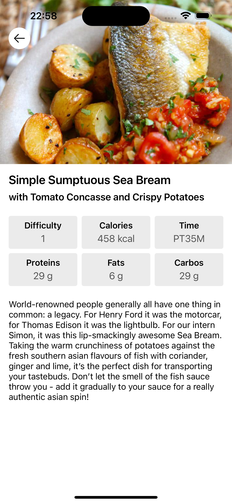

# Th Digital BA Take Home Assessment

Home screen                |  Recipe Details screen
:-------------------------:|:-------------------------:
  |  

Simple iOS Recipes Application. 

## Functions
* Displaying recipes list.
* Viewing recipe details.

## Projects structure, technologies and methodologies
* Coordinator Pattern + Clean Architecture + MVVM as base structure.
* UIKit and Combine (functional reactive programming).
* Repository pattern for data layer abstraction.
* CoreData as local storage.

## Future Improvements:
* Adding Units Test for all Use Cases, View Models and Utilities classes
* Adding appropriate descriptions to classess and methods
* Improve UI for Home and Recipe details screens
